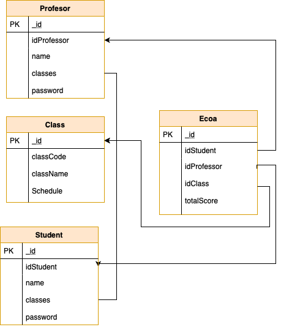

# Proyecto Aprendizaje automatico
Enrique Lira Martinez A01023351<br/>
Emiliano Abascal Gurria A01023234<br/>
Antony Adrian Morales Rosas A01019582<br/>
Esmeralda Magdaleno Morales A01023086<br/>

# Descripción del proyecto

Este repositorio contiene el código para crear una aplicación web que está configurada por medio de los servicios de azure functions, esta esta aplicación hacemos uso de Node.js y mongoDB. Utilizamos los servicios de Azure para alojar nuestra aplicación; la CLI de Azure Tools para ejecutar y depurar localmente; y, por último, proporcionar comandos para implementar en Azure functions 

En este proyecto, se implemento una aplicación que use MongoDB y Node.js. esta aplicación se hace cargo de poder acceder a la base de datos y responder un serie de request proporcionada por el client, la aplicación se encarga de recibir las ecoas generadas por el estudiante y después poder madarlas a analizar al la api de Azure cognitive services, este nos regresa un análisis con los score de cada pregunta y la keyphrases de las estas, esto se guardara en un base de datos realizadas en mongoDB y cada profesor podrá revisar los resultados de las ecoas 

# Análisis de los sentimientos

Utilizamos el análisis de sentimientos para averiguar qué piensan los alumnos de sus clases o profesores, mediante el análisis de texto sin procesar, busca una serie de pistas sobre sentimientos positivos o negativos. Esta API devuelve una puntuación de opinión entre 0 y 1 para cada documento, donde 1 es el más positivo. El modelos de análisis se entrenan previamente utilizando un extenso cuerpo de texto y tecnologías de lenguaje natural de Microsoft.

# Extracción de frase clave
Extraer automáticamente frases clave para identificar rápidamente los puntos principales.

# Prerrequisitos
- Suscripción de Azure
- Azure functions en Node.js.

# Uso 

Una vez que tenga su suscripción de Azure, cree un recurso de Text Analytics en Azure Portal para obtener su clave y punto final. Después de que se implemente necesitará la clave y el punto final del recurso que cree para conectar su aplicación a la API de Text Analytics por medio de una azure function previamente creada, este ejemplo se encuentra en la function createEcoa. El servicio regresara un json con los scores generados por el texto y las palabras claves del análisis.

Los datos que recolectamos del servicio son 
-	ID: 0 
-	Document Sentiment: positive
-	Document Scores:
                Positive: 1.00  Negative: 0.00  Neutral: 0.00
-	Document Key Phrases: cat,veterinarian

Al finalizar guardamos un json con la recopilación de los sentimientos en mongo altas


# Estructura del repositorio
El proyecto debe seguir la siguiente estructura de carpetas, la cual generamos por usted:
```
- / 			        # Raíz de todo el proyecto
- README.md				# Archivo con los datos del proyecto (este archivo)
- CreateClass			# Carpeta con la function crear clase
- CreateEcoa			# Carpeta con la function crear ecoa
- CreateProfesor		# Carpeta con la function crear profesor
- CreateStudents		# Carpeta con la function crear estudiante
- GetClass				# Carpeta con la function obtener clase
- GetEcoasbyIdProfesor	# Carpeta con la function obtener ecoas por profesor
- getScoreEcoas			# Carpeta con la function obtener score de las ecoas 
- GetUser				# Carpeta con la function obtener al usuario
- professorLogin		# Carpeta con la function para hacer login del profesor
- studentLogIn			# Carpeta con la function para hacer login del estudiante
- TotalScore			# Carpeta con la function para sacar el total de los scores
- db.js			      	# Carpeta con los modelos, catálogos y scripts necesarios para generar las bases de datos
- models			  	# Carpeta donde se almacena los modelos y schemas de la base de datos 
- host.json				#version del azure fuctions  
- local.settings.json 	#configuaracion de las functions 
```

## Quickstart
Guia para correr el programa de manera rápida
- Debes hacer login con tu azure account y instalar Azure Tool core
1. Clonar repositorio e ir hacia la carpeta
```bash 
git clone git clone https://github.com/Lira97/ProfesoresFunctions
```
3. Debes de tener npm instalado

4. Run npm para instalar dependecias 
```bash 
npm install
``` 
5. Install Azure Functions:
[Instructions](https://docs.microsoft.com/en-us/azure/azure-functions/functions-run-local?tabs=macos%2Ccsharp%2Cbash#brew)

6. Run Azure Functions con azure tools:
```bash 
func host start
```  
# Uso
Esta es una explicación más detallada de los archivos y funciones principales que se usan.

# Archivos Azure functions Node.js

The samples available in this folder demonstrate how to implement a in JavaScript.

Example functions featured in this repo include:

| Name | Trigger | Endpoint Local |
|------|---------|---------|
| [CreateClass](CreateClass) | HTTP|http://localhost:7071/api/CreateClass
| [CreateEcoa](CreateEcoa) | HTTP| http://localhost:7071/api/CreateEcoa 
| [CreateProfesor](CreateProfesor) | HTTP| http://localhost:7071/api/CreateProfesor 
| [CreateStudents](CreateStudents) | HTTP| http://localhost:7071/api/CreateStudents  
| [GetClass](GetClass) | HTTP| http://localhost:7071/api/CreateClass  
| [GetEcoasbyIdProfesor](GetEcoasbyIdProfesor) | HTTP| http://localhost:7071/api/GetEcoasbyIdProfesor 
| [GetProfesor](GetProfesor) | HTTP| http://localhost:7071/api/GetProfesor 
| [GetUser](GetUser) | HTTP| http://localhost:7071/api/GetUser
| [studentLogIn](studentLogIn) | HTTP| http://localhost:7071/api/studentLogIn
| [professorLogin](professorLogin) | HTTP| http://localhost:7071/api/professorLogin
| [TotalScore](TotalScore) | HTTP| http://localhost:7071/api/TotalScore
| [getScoreEcoas](getScoreEcoas) | HTTP| http://localhost:7071/api/getScoreEcoas

# Azure Functions inputs and Explanation

[CreateClass](CreateClass) 
Este endpoint se encarga de registrar la clase usuario en la base de datos, su funcionamiento consiste en revisar si la clase existe en la base de datos, si el usuario no existe
Example json 
- request
```json
  {
    "classCode":"CS4013",
    "className":"Aprendizaje automatico"
  }
```
- response
```json
	{
	"_id": "5ed5c77b8ce5832df964cebe",
	"classCode": "CS",
	"className": "Aprendizaje automatico",
	"__v": 0
	}
```
[CreateEcoa](CreateEcoa)
Este endpoint se encarga de registrar la ecoa de los estudiantes en la base de datos, su funcionamiento consiste mandar a la api de congitive services las respuestas generadas por los alumnos y guardar los scores y kephrases generados 
Example json
- request
```json
{
	"questions": [
		"El profesor conoce el tema pero definitivamente no conoce nada sobre dar clases, habla hora y media en frente de la clase sin importar quien entiende y quien no, las respuestas a las dudas son ambiguas y extremadamente rápidas que hacen que te quedes igual. Las tareas rozan en lo absurdo, se podría",

		"Es un profesor que como persona es excelente, sin embargo en las clases si hay que dedicar tiempo para entender y estudiar por tu parte, si tienes dudas el te ayuda en asesoria. Cuidado en los parciales uno es dificil otro es facil y el final es horrible nadie lo pasa. si sacas 40 o 50 dala de baja",
		
    	"Mediocre, prepotente, ignorante, injusta y bipolar, la peor profesora que he tenido en mi carrera. Sus explicaciones son lo peor del mundo, ni ella se entiende. No me explico como pueden poner a este tipo de personas en un aula. No metan ninguna materia con ella, deberían correrla. Hipócrita."
    	,
    	"Es la maestras mas barco del Tec pero se jura la más brillante, si eres aplicado no vale la pena meter nada con ella porque no hay forma de estudiar con sus clases mediocres pero si buscas algo facil y barco y eres bueno cayendole bien a los maestros y haciendo la barba estas del otro lado sin mover un solo dedo. Pasa lista siempre."
    	,
    	"la recomiendo para hechar la hueva, igual q es una materia de relleno. te dice algo y hace otra cosa, te dice q estudies algo y a la hora del examen te dice q tenia q estudiar todo y es ahi donde atora de 95 a 85 no ayuda nada yno ensena nada"

    	],
    "idStudent": "5ec71051ce0d1f4de9d81bc2",
    "idProfessor": "5ec70712d5b3284aae045b29",
    "idClass": "5ec6f48e51b963463540d34a"
}
```
- response
```json
	{
	"msg":"savecoa"
	}
```
[CreateProfesor](CreateProfesor) 
Este endpoint se encarga de registrar un Profesor en la base de datos, su funcionamiento consiste en revisar si el Profesor existe en la base de datos, si el Profesor no existe se permite el registro del Profesor y sus datos terminan en la base de datos
Example json 
- request
```json
{
	"idProfessor": "RF01023387",
    "name": "Martha Verónica Legarda Z",
    "class": ["5ec6f4fe51b963463540d34c"],
    "password": "password"
}
```
- response
```json
	{
		"_id": "5ed5c77b8ce5832df964cebe",
	"idProfessor": "RF01023387",
    "name": "Martha Verónica Legarda Z",
    "class": ["5ec6f4fe51b963463540d34c"],
    "password": "fsdfs655659656fsdf/",
	"__v": 0
	}
```
[CreateStudents](CreateStudents) 
Este endpoint se encarga de registrar un Students en la base de datos, su funcionamiento consiste en revisar si el Students existe en la base de datos, si el Students no existe se permite el registro del Students y sus datos terminan en la base de datos
Example json
- request
```json
{
	"idStudent": "A01023351",
    "name": "Enrique Lira Martinez",
    "class": ["5ec6f48e51b963463540d34a","5ec6f4de51b963463540d34b","5ec6f4fe51b963463540d34c","5ec6f52751b963463540d34e","5ec6f55a51b963463540d34f"],
    "password": "password"
}
```
- response
```json
	{
		"_id": "5ed5c77b8ce5832df964cebe",
		"idStudent": "A01023351",
		"name": "Enrique Lira Martinez",
		"class": ["5ec6f48e51b963463540d34a","5ec6f4de51b963463540d34b","5ec6f4fe51b963463540d34c","5ec6f52751b963463540d34e","5ec6f55a51b963463540d34f"],
		"password": "fsdfs655659656fsdf/",
		"__v": 0
	}
```
[GetClass](GetClass)  
Este endpoint obtiene los datos de la Class.
Example json
- request
```json
{
	"idClass": "TC2011"
}
```
- reponse
```json
{
  "_id": "5ec6f48e51b963463540d34a",
  "classCode": "TC2011",
  "className": "Sistemas inteligentes",
  "__v": 0
}
```
[GetEcoasbyIdProfesor](GetEcoasbyIdProfesor) 
Este endpoint obtiene las ecoas generadas por los alumnos dependiendo del la Clase y e profesor.
Example json
- request
```json
{
	"idProfessor": "5ec70712d5b3284aae045b29",
	"idClass":"5ec6f48e51b963463540d34a"
}
```
- response 
```json
{
    "questions": [
      {
        "id": "0",
        "sentiment": "negative",
        "confidenceScores": {
          "positive": 0.08,
          "neutral": 0.08,
          "negative": 0.84
        },
        "keyPhrases": [
          "Las tareas rozan en",
          "clase sin importar quien entiende y quien",
          "habla hora y media en frente",
          "profesor conoce",
          "dudas son ambiguas y extremadamente rápidas que hacen que te quedes igual",
          "conoce nada sobre dar clases",
          "tema pero definitivamente",
          "respuestas",
          "absurdo",
          "se podría"
        ],
        "answers": "El profesor conoce el tema pero definitivamente no conoce nada sobre dar clases, habla hora y media en frente de la clase sin importar quien entiende y quien no, las respuestas a las dudas son ambiguas y extremadamente rápidas que hacen que te quedes igual. Las tareas rozan en lo absurdo, se podría"
      },
      {
        "id": "1",
        "sentiment": "negative",
        "confidenceScores": {
          "positive": 0.19,
          "neutral": 0.01,
          "negative": 0.8
        },
        "keyPhrases": [
          "Cuidado en los parciales uno es dificil otro es facil y",
          "final es horrible nadie",
          "si sacas",
          "profesor que como persona es excelente",
          "sin embargo en",
          "si tienes dudas",
          "te ayuda en asesoria",
          "clases si hay que dedicar tiempo para entender y estudiar por tu parte",
          "dala",
          "pasa"
        ],
        "answers": "Es un profesor que como persona es excelente, sin embargo en las clases si hay que dedicar tiempo para entender y estudiar por tu parte, si tienes dudas el te ayuda en asesoria. Cuidado en los parciales uno es dificil otro es facil y el final es horrible nadie lo pasa. si sacas 40 o 50 dala de baja"
      },
      {
        "id": "2",
        "sentiment": "mixed",
        "confidenceScores": {
          "positive": 0.16,
          "neutral": 0.09,
          "negative": 0.75
        },
        "keyPhrases": [
          "personas en",
          "peor profesora que",
          "tenido en mi carrera",
          "ni ella se entiende",
          "este tipo",
          "mundo",
          "injusta y bipolar",
          "explico como pueden poner",
          "prepotente",
          "ignorante"
        ],
        "answers": "Mediocre, prepotente, ignorante, injusta y bipolar, la peor profesora que he tenido en mi carrera. Sus explicaciones son lo peor del mundo, ni ella se entiende. No me explico como pueden poner a este tipo de personas en un aula. No metan ninguna materia con ella, deberían correrla. Hipócrita."
      },
      {
        "id": "3",
        "sentiment": "mixed",
        "confidenceScores": {
          "positive": 0.41,
          "neutral": 0.06,
          "negative": 0.53
        },
        "keyPhrases": [
          "si eres aplicado",
          "sus clases mediocres pero si buscas algo facil y barco y eres bueno cayendole bien",
          "los maestros y haciendo",
          "maestras mas barco",
          "Tec pero se jura",
          "barba estas",
          "estudiar",
          "más brillante",
          "hay forma",
          "pena meter nada",
          "vale",
          "otro lado sin mover",
          "ella porque",
          "solo dedo"
        ],
        "answers": "Es la maestras mas barco del Tec pero se jura la más brillante, si eres aplicado no vale la pena meter nada con ella porque no hay forma de estudiar con sus clases mediocres pero si buscas algo facil y barco y eres bueno cayendole bien a los maestros y haciendo la barba estas del otro lado sin mover un solo dedo. Pasa lista siempre."
      },
      {
        "id": "4",
        "sentiment": "mixed",
        "confidenceScores": {
          "positive": 0.5,
          "neutral": 0.11,
          "negative": 0.39
        },
        "keyPhrases": [
          "te dice q estudies algo y",
          "examen te dice q tenia q estudiar todo y es ahi donde atora",
          "te dice algo y hace otra cosa",
          "igual q es una materia",
          "ayuda nada yno ensena nada",
          "hora",
          "hueva",
          "recomiendo para hechar",
          "relleno"
        ],
        "answers": "la recomiendo para hechar la hueva, igual q es una materia de relleno. te dice algo y hace otra cosa, te dice q estudies algo y a la hora del examen te dice q tenia q estudiar todo y es ahi donde atora de 95 a 85 no ayuda nada yno ensena nada"
      }
    ],
    "_id": "5ed58798211dde277972cf7c",
    "idClass": {
      "_id": "5ec6f48e51b963463540d34a",
      "classCode": "TC2011",
      "className": "Sistemas inteligentes",
      "__v": 0
    }
  }
```
[GetProfesor](GetProfesor) 
Este endpoint obtiene los datos del profesor con una conexión a los documentos de class .
Example json
- request
```json
{
	"idProfessor": "RF01023352"
}
```
- response
```json
{
  "classes": [
    {
      "_id": "5ec6f48e51b963463540d34a",
      "classCode": "TC2011",
      "className": "Sistemas inteligentes",
      "__v": 0
    }
  ],
  "_id": "5ec70712d5b3284aae045b29",
  "idProfessor": "RF01023352",
  "name": "Carlos Enrique Vega A",
  "password": "$2a$10$MXgmwnNmp2qrw/RgEImPF.6cpg5HkQ7Z6BRRrca4ZnoSUb889jMzq",
  "Ecoa1": 78,
  "Ecoa2": 85,
  "__v": 0
}
```
[GetUser](GetUser) 
Este endpoint obtiene los datos del estudiante con una conexión a los documentos de class .
Example json
request
```json
{
	"idStudent": "A01023351"
}
```
response 
```json
{
  "_id": "5ec71051ce0d1f4de9d11bc2",
  "idStudent": "A01023351",
  "name": "Enrique Lira Martinez",
  "classes": [
    {
      "class": {
        "_id": "5ec6f48e51b963463540d34a",
        "classCode": "TC2011",
        "className": "Sistemas inteligentes",
        "__v": 0
      },
      "teachear": {
        "classes": [
          "5ec6f48e51b963463540d34a"
        ],
        "_id": "5ec70712d5b3284aae045b29",
        "idProfessor": "RF01023352",
        "name": "Carlos Enrique Vega A",
        "password": "$2a$10$MXgmwnNmp2qrw/RgEImPF.6cpg5HkQ7Z6BRRrca4ZnoSUb889jMzq",
        "Ecoa1": 78,
        "Ecoa2": 85,
        "__v": 0
      }
    },
    {
      "class": {
        "_id": "5ec6f4de51b963463540d34b",
        "classCode": "TC3052",
        "className": "Laboratorio de desarrollo de aplicaciones Web",
        "__v": 0
      },
      "teachear": {
        "classes": [
          "5ec6f4de51b963463540d34b"
        ],
        "_id": "5ec70732d5b3284aae045b2a",
        "idProfessor": "RF01023355",
        "name": "Rubén Raya D",
        "password": "$2a$10$3uJH8.sXYEm1bnR6uIvNqORMbpHW1dFnQJCtyXF9elOOq8bLnB5sK",
        "Ecoa1": 89,
        "Ecoa2": 77,
        "__v": 0
      }
    },
    {
      "class": {
        "_id": "5ec6f52751b963463540d34e",
        "classCode": "TC3054",
        "className": "Proyecto integrador para el desarrollo de soluciones empresariales",
        "__v": 0
      },
      "teachear": {
        "classes": [
          "5ec6f52751b963463540d34e"
        ],
        "_id": "5ec7076dd5b3284aae045b2c",
        "idProfessor": "RF01023359",
        "name": "José Francisco Corona C",
        "password": "$2a$10$enEWUQiiojkUO1HJMFTEWeJX0kzesXDlR2KfLmSFkxGW5j.uo3uGS",
        "Ecoa1": 70,
        "Ecoa2": 79,
        "__v": 0
      }
    },
    {
      "class": {
        "_id": "5ec6f55a51b963463540d34f",
        "classCode": "CS4013",
        "className": "Aprendizaje automatico",
        "__v": 0
      },
      "teachear": {
        "classes": [
          "5ec6f55a51b963463540d34f"
        ],
        "_id": "5ec70785d5b3284aae045b2d",
        "idProfessor": "RF01023320",
        "name": "David",
        "password": "$2a$10$hRWkqTtxGnBTO9xTlZUBcu/BaiUYtyM30HizO3qUvr3A8X..qW6sS",
        "Ecoa1": 95,
        "Ecoa2": 93,
        "__v": 0
      }
    },
    {
      "class": {
        "_id": "5ec6f4fe51b963463540d34c",
        "classCode": "TI3035",
        "className": "Introducción a la vida profesional",
        "__v": 0
      },
      "teachear": {
        "classes": [
          "5ec6f4fe51b963463540d34c"
        ],
        "_id": "5ec707b1d5b3284aae045b2e",
        "idProfessor": "RF01023387",
        "name": "Martha Verónica Legarda Z",
        "password": "$2a$10$CVGPX/NgIr6.x7rogpRNZO4rteUn9/gGQziiNt4FZWQoOUvAkl/42",
        "Ecoa1": 90,
        "Ecoa2": 87,
        "__v": 0
      }
    }
  ],
  "password": "$2a$10$UQ/GZhnos9n7ONASbuW56uDwadf9CKbZYtXZopUjLAbNVqtSNiqCC",
  "__v": 0
}
```
[studentLogIn](studentLogIn)
Este endpoint se encarga de autehticar las cuenta de cada alumno
Example json
- request
```json
{
	"idStudent":"A01023351",
	"password":"passord"
}
```
-response
```json
{
  "object_id": "5ec71051ce0d1f4de9d11bc2",
  "idStudent": "A01023351",
  "studentName": "Enrique Lira Martinez"
}
```
[professorLogin](professorLogin) 
Este endpoint se encarga de autehticar las cuenta de cada profesor
Example json
- request
```json
{
	"idProfessor":"RF01023352",
	"password":"passord"
}
```
- response
```json 
{
  "object_id": "5ec707b1d5b3284aae045b2e",
  "idProfessor": "RF01023387",
  "ProfesorName": "Martha Verónica Legarda Z",
  "clases": [
    {
      "_id": "5ec6f4fe51b963463540d34c",
      "classCode": "TI3035",
      "className": "Introducción a la vida profesional",
      "__v": 0
    }
  ],
  "Ecoa1": 90,
  "Ecoa2": 87
}
```
[TotalScore](TotalScore)
Este endpoint se regresar el numero total de scores generados 
Example json
- request
```json
{
	"idProfessor": "5ec70712d5b3284aae045b29",
	"idClass":"5ec6f48e51b963463540d34a"
}
```
- response 
```json
{
  "positiveTotal": 26.8,
  "negativeTotal": 66.2,
  "neutralTotal": 7
}
```
[getScoreEcoas](getScoreEcoas) 
Este endpoint se regresar las calificacion de las ecoas pasadas
Example json
- request
```json
{
	"idProfessor": "RF01023352"
}
```
- reponse
```json
{
  "Ecoa1": 78,
  "Ecoa2": 85
}
```
# Diagrama de Base



## Configuration

Local.settings-example.json  se proporciona para mostrar los valores que la aplicación espera leer de las variables de entorno. Haga una copia de * local.settings-example.json * y cámbiele el nombre * local.settings.json * y reemplace cualquier valor que comience por "** YOUR _ **" con sus valores.

