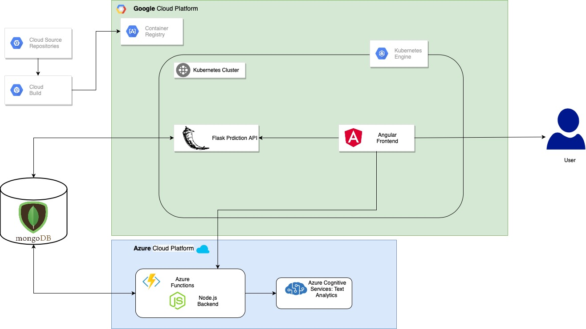

# Teacher Grader
Enrique Lira Martínez A01023351<br/>
Emiliano Abascal Gurría A01023234<br/>
Antony Adrian Morales Rosas A01019582<br/>
Esmeralda Magdaleno Morales A01023086<br/>

# Resumen
Este proyecto fue desarrollado para el curso de “Aprendizaje Automático” impartido en el Tecnológico de Monterrey, el cual consiste en una aplicación web desplegada en la nube, la cual permite a alumnos evaluar a sus profesores utilizando lenguaje natural, mientras que también permite a profesores visualizar sus evaluaciones y una predicción de su futuro desempeño basado en evaluaciones pasadas utilizando métodos de aprendizaje automático.

# Planteamiento del problema
Hoy en dia las evaluaciones realizadas por alumnos hacia los profesores se hace normalmente con cuestionarios que van por lo general del 1 al 10, siendo el 1 la peor calificación y 10 la mejor, sin embargo en diversas situaciones los alumnos realizan estas evaluaciones de una manera rápida y aleatoria, por lo que las evaluaciones no son necesariamente representativas del desempeño del profesor. 

# Objetivo
El objetivo de este proyecto es desarrollar una plataforma en la cual se puedan llevar a cabo evaluaciones de una forma más eficiente y honesta de parte de los alumnos, de igual forma que sea útil para los profesores no solo para ver sus calificaciones, sino que también para que puedan ver retroalimentación sobre sus clases.

# Solución
Para cumplir el anterior objetivo se planteo desarrollar una aplicacion web, la cual permitirá a los alumnos realizar las evaluaciones de sus profesores a través de unas cuantas preguntas abiertas, estas preguntas se analizarán para determinar cuál es la connotación emocional de una respuesta y determinar su puntaje, basado en estas evaluaciones se determinará también la calificación de una clase, y utilizando regresiones lineales, se determinará cuál sería el resultado de sus próximas evaluaciones.

Para lograr lo anterior se implementaron dos APIs, una que realiza las predicciones de los profesores, y otra que se utiliza como backend para nuestra aplicación web, el cual se encarga de proveer de información al servicio de frontend. Tanto la API de predicciones como el frontend de nuestra app web, están desplegados en Kubernetes, la base de datos en Atlas por mongodb y el backend está desplegado en funciones “serverless”.

# Alcance
El alcance final del proyecto es contar con la aplicación web terminada con las capacidades para que los alumnos hagan evaluaciones sobre un curso y los profesores puedan visualizar sus calificaciones de manera apropiada así como las predicciones que los pueden ayudar a mejorar sus métodos de enseñanza.

# Diagrama de Arquitectura



# Tecnologías

- Angular
- Mongo Atlas
- API (flask)
- Azure functions (node.js)
- Google Cloud Platform

# Dataset

Se utilizó un datasets en el cual se adquieren las calificaciones de los profesores en los últimos años, este se divide en la ecoa1, ecoas2, ecoas3. Los datos incluyen las asistencias de los alumnos y la dificultad de la materia.

# API

Se desarrollo la API de predicción con Flask gracias a las librerías para que contiene este lenguaje y a lo sencillo que es Python, la parte de bases de datos y análisis de sentimiento se realizaron con azure functions con el lenguaje de programación node.js

# Dependencias

- Flask
- pandas
- numpy
- sklearn
- matplotlib
- Moongose
- Node.js
- Angular 

# Prerrequisitos
- `Docker`
- `Node.js`

# Quickstart
Guia para correr el programa de manera rápida

1. Clonar repositorio 
```bash 
git clone https://github.com/esmemag96/AprendizajeAutomaticoEntregaFinal
``` 
2. Ir hacia la carpeta
```bash 
cd AprendizajeAutomaticoEntregaFinal
``` 
3. Ejecutar docker

4. Si se agregó un nuevo modulo de python a ´requirements.txt´:
```bash 
docker-compose build
``` 

5. Run docker 
```bash 
docker-compose up 
``` 

6. Frontend: http://localhost:80 Flask: http://localhost:5000

7. Da click en el boton de train para entrenar el modelo con el dataset

8. Ingresa los valores a predecir 

# Uso
Esta es una explicación más detallada de los archivos y funciones principales que se usan.

## Archivos Python (Flask)
### App.py: 
Este archivo es la API que se encarga de realizar las predicciones sobre las calificaciones futuras de los profesores.

Función `predict()`: Se utiliza para predecir los valores, la función se llama cuando se hace una solicitud HTTP de tipo GET, en la cual deben estar los parámetros ‘TeacherID’, ‘ClassID’, ‘grade1’ y ‘grade2’, la funcion se encarga posteriormente a realizar la predicción y enviar el resultado al front end.

Función `getGraphs()`: Se utiliza para regresar los valores a graficar sobre cada entrenamiento que se hace,  la función se llama cuando se hace una solicitud HTTP de tipo GET, en la cual deben estar los parámetros ‘TeacherID’ y ‘ClassID’, regresa una imagen y datos para graficar.

### helperScripts/Functions.py: Este archivo se encarga de realizar el entrenamiento del modelo.

función `Train()`: En esta función importamos el dataset y primero indexamos el campo del instructor, luego seleccionamos el maestro que vamos a analizar y también a la clase. Tomamos los ejes x e y para la regresión lineal, nuestro eje X será Ecoa1 Ecoa2 y el eje Y será Ecoa3, después de que tomamos los elementos X y Y para hacer un modelo y predecir las calificaciones de Ecoas3 basadas en las primeras ecoas. El modelo debe ajustarse al modelo de regresión lineal al conjunto de entrenamiento y crear un archivo con model.pkl y el gráfico png que obtenemos de las predicciones.

Se ajusta el modelo de regresión lineal múltiple a nuestro conjunto de entrenamiento. Utilizamos el método de ajuste junto con los argumentos del método de ajuste, los cuales serán conjuntos de entrenamiento y luego creamos un modelo de archivo que contiene el modelo de entrenamiento.

función `GraficaMean()`: 
En esta función importamos el dataset y primero indexamos el campo del instructor, luego seleccionamos el maestro que vamos a analizar y también a la clase. Después obtenemos los valores de la ecoa 1 y la ecoa 2 y sacamos sus medias, regresamos el arreglo de la ecoa 1 y 2 con sus respectivas medias 

## Azure Functions (Node.js)

Este repositorio contiene el código para crear una aplicación web que está configurada por medio de los servicios de azure functions, esta esta aplicación hacemos uso de Node.js y mongoDB. Utilizamos los servicios de Azure para alojar nuestra aplicación; la CLI de Azure Tools para ejecutar y depurar localmente; y, por último, proporcionar comandos para implementar en Azure functions 

En este proyecto, se implemento una aplicación que use MongoDB y Node.js. esta aplicación se hace cargo de poder acceder a la base de datos y responder un serie de request proporcionada por el client, la aplicación se encarga de recibir las ecoas generadas por el estudiante y después poder madarlas a analizar al la api de Azure cognitive services, este nos regresa un análisis con los score de cada pregunta y la keyphrases de las estas, esto se guardara en un base de datos realizadas en mongoDB y cada profesor podrá revisar los resultados de las ecoas 

### Análisis de los sentimientos

Utilizamos el análisis de sentimientos para averiguar qué piensan los alumnos de sus clases o profesores, mediante el análisis de texto sin procesar, busca una serie de pistas sobre sentimientos positivos o negativos. Esta API devuelve una puntuación de opinión entre 0 y 1 para cada documento, donde 1 es el más positivo. El modelos de análisis se entrenan previamente utilizando un extenso cuerpo de texto y tecnologías de lenguaje natural de Microsoft.

### Extracción de frase clave
Extraer automáticamente frases clave para identificar rápidamente los puntos principales.

### Prerrequisitos
- Suscripción de Azure
- Azure functions en Node.js.

### Uso 

Una vez que tenga su suscripción de Azure, cree un recurso de Text Analytics en Azure Portal para obtener su clave y punto final. Después de que se implemente necesitará la clave y el punto final del recurso que cree para conectar su aplicación a la API de Text Analytics por medio de una azure function previamente creada, este ejemplo se encuentra en la function createEcoa. El servicio regresara un json con los scores generados por el texto y las palabras claves del análisis.

Los datos que recolectamos del servicio son 
-	ID: 0 
-	Document Sentiment: positive
-	Document Scores:
                Positive: 1.00  Negative: 0.00  Neutral: 0.00
-	Document Key Phrases: cat,veterinarian

Al finalizar guardamos un json con la recopilación de los sentimientos en altas mongo

para mas informacion sobre las functions y la base de datos [AzureFunctions](AzureFunctions)


## Archivos Front End (Angular):
### Frontend/src/app/main-components
Carpeta donde se encuentran los componentes que integran la solución.
### Frontend/src/app/model
Carpeta donde se encuentran las interfaces de los modelos de datos utilizados.
### Frontend/src/app/services
Carpeta donde se encuentran las funciones que realizan las peticiones al Backend.
### Frontend/src/app/environments
Carpeta donde se definen los endpoints utilizados.

## Archivos Docker:
### Flask/Dockerfile: 
Dockerfile para el contenedor de FLASK.
### Frontend/Dockerfile: 
Dockerfile para el contenedor de Angular.
### Flask/requirements.txt: 
Archivo que se utiliza para cargar las dependencias del contenedor de flask, por ejemplo ´numpy´.
### docker-compose.yml: 
Archivo Docker-Compose para levantar todos los contenedores necesarios (Flask, Angular).

## Archivos Kubernetes:
### Flask/flask-backend-deployment.yaml
Archivo utilizado para desplegar contenedor de Flask en Kubernetes.
### Frontend/angular-frontend-deployment.yaml
Archivo utilizado para desplegar contenedor de Frontend en Kubernetes.
### Frontend/angular-frontend-claim0-persistentvolumeclaim.yaml
Archivo utilizado para desplegar volumen persistente para Frontend en Kubernetes.

